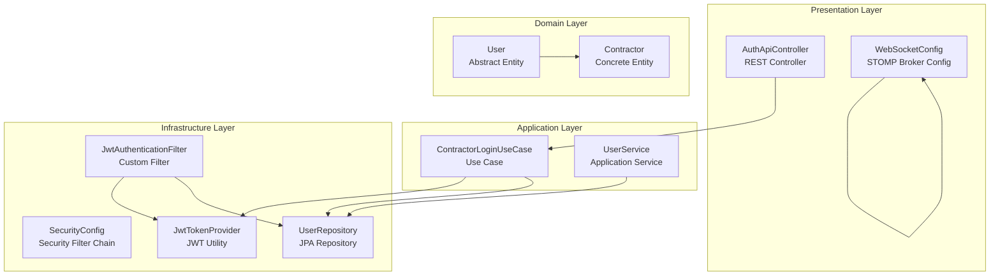
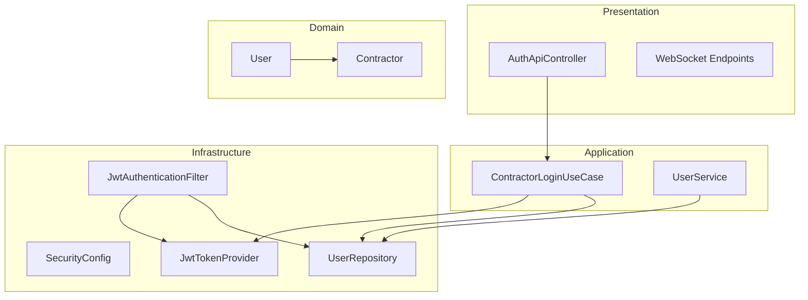
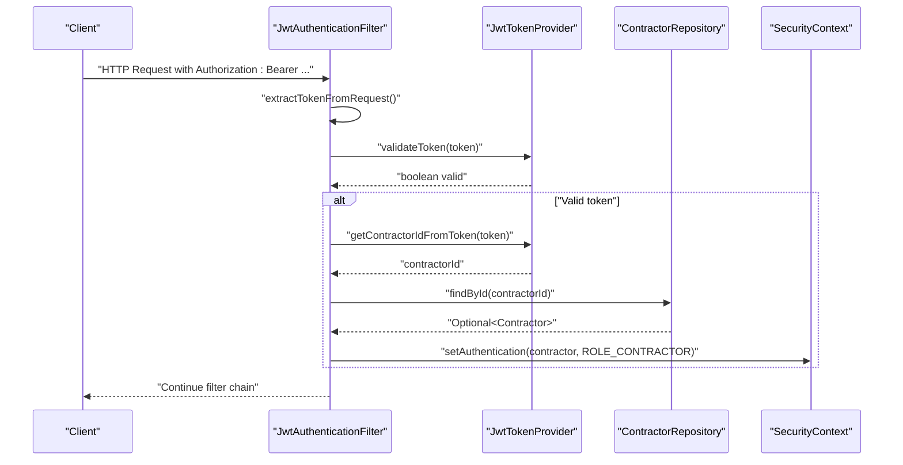
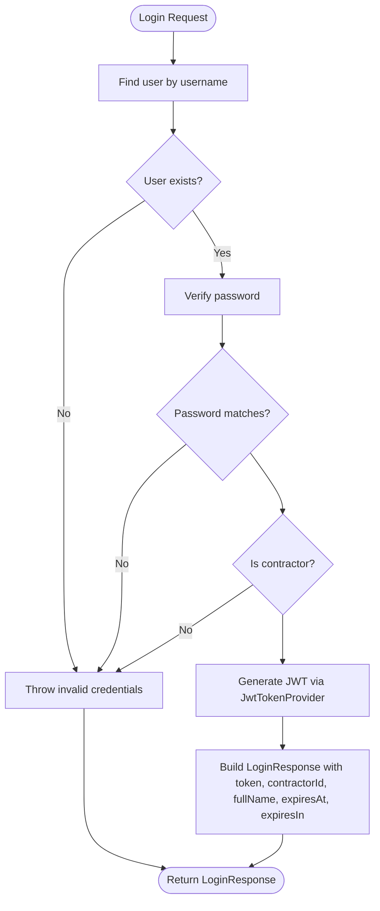
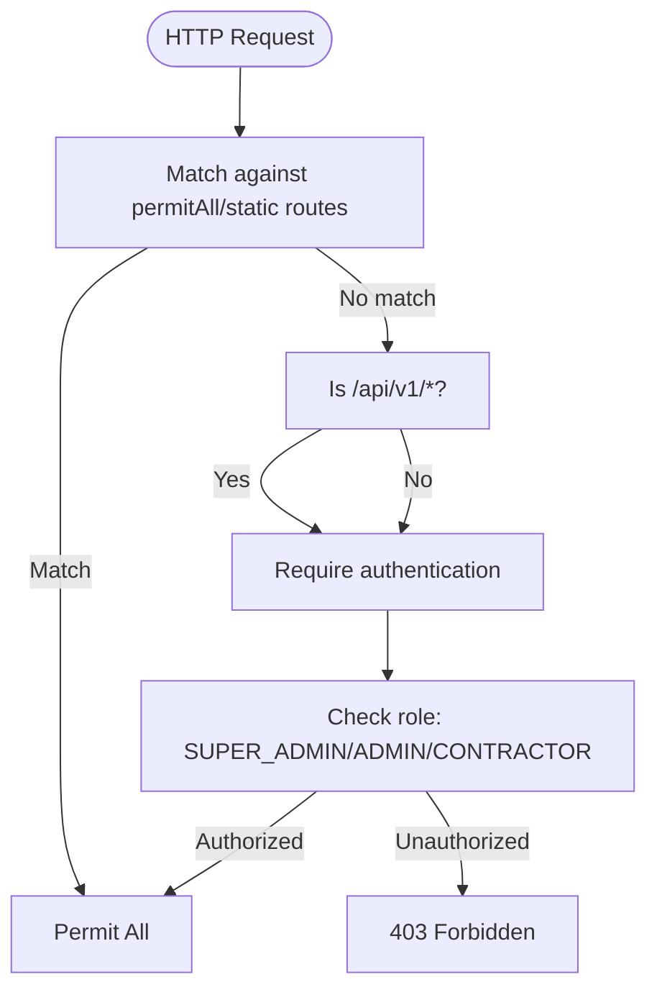
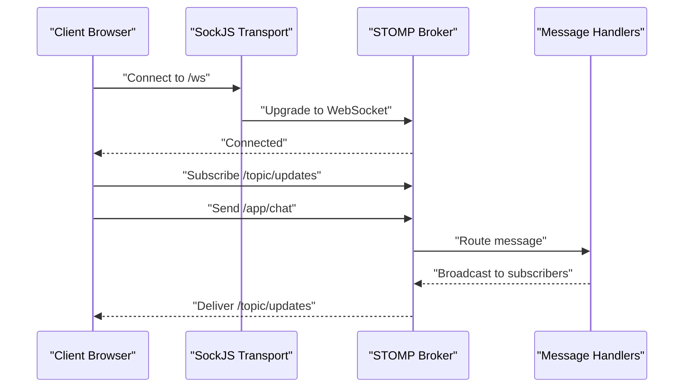
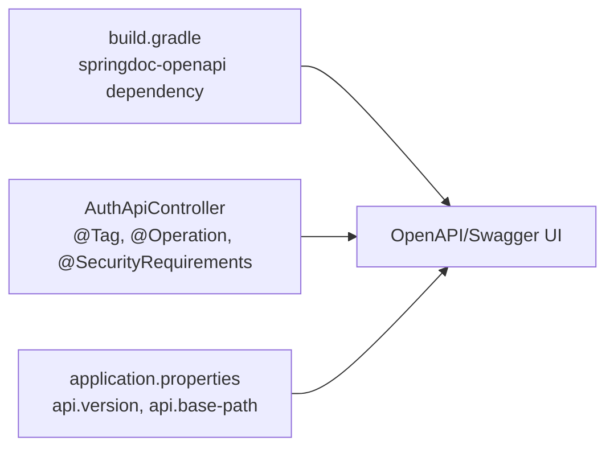
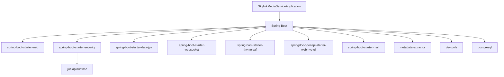

# System Architecture

<cite>
**Referenced Files in This Document**
- [SkylinkMediaServiceApplication.java](file://src/main/java/root/cyb/mh/skylink_media_service/SkylinkMediaServiceApplication.java)
- [SecurityConfig.java](file://src/main/java/root/cyb/mh/skylink_media_service/infrastructure/security/SecurityConfig.java)
- [JwtAuthenticationFilter.java](file://src/main/java/root/cyb/mh/skylink_media_service/infrastructure/security/jwt/JwtAuthenticationFilter.java)
- [JwtTokenProvider.java](file://src/main/java/root/cyb/mh/skylink_media_service/infrastructure/security/jwt/JwtTokenProvider.java)
- [AuthApiController.java](file://src/main/java/root/cyb/mh/skylink_media_service/infrastructure/web/api/AuthApiController.java)
- [ContractorLoginUseCase.java](file://src/main/java/root/cyb/mh/skylink_media_service/application/usecases/ContractorLoginUseCase.java)
- [UserService.java](file://src/main/java/root/cyb/mh/skylink_media_service/application/services/UserService.java)
- [User.java](file://src/main/java/root/cyb/mh/skylink_media_service/domain/entities/User.java)
- [Contractor.java](file://src/main/java/root/cyb/mh/skylink_media_service/domain/entities/Contractor.java)
- [UserRepository.java](file://src/main/java/root/cyb/mh/skylink_media_service/infrastructure/persistence/UserRepository.java)
- [WebSocketConfig.java](file://src/main/java/root/cyb/mh/skylink_media_service/infrastructure/config/WebSocketConfig.java)
- [application.properties](file://src/main/resources/application.properties)
- [build.gradle](file://build.gradle)
</cite>

## Table of Contents
1. [Introduction](#introduction)
2. [Project Structure](#project-structure)
3. [Core Components](#core-components)
4. [Architecture Overview](#architecture-overview)
5. [Detailed Component Analysis](#detailed-component-analysis)
6. [Dependency Analysis](#dependency-analysis)
7. [Performance Considerations](#performance-considerations)
8. [Troubleshooting Guide](#troubleshooting-guide)
9. [Conclusion](#conclusion)
10. [Appendices](#appendices)

## Introduction
This document describes the system architecture of the Skylink Media Service backend. The system follows Clean Architecture principles with clear layer separation:
- Presentation: REST controllers and WebSocket endpoints
- Application: Use cases and application services orchestrating business workflows
- Domain: Entities, value objects, and domain services encapsulating business logic
- Infrastructure: Persistence repositories, security filters, configuration, and external integrations

The system integrates Spring Boot with Spring Security (JWT), Spring Data JPA, Spring WebSocket, and Swagger/OpenAPI for API documentation. It supports role-based access control, real-time communication via WebSocket, and robust configuration through application properties.

## Project Structure
The project is organized by layers and bounded contexts:
- application: DTOs, use cases, and application services
- domain: entities, value objects, and domain events
- infrastructure: Spring configuration, security, persistence, storage, and web endpoints
- resources: configuration files and static assets



**Diagram sources**
- [AuthApiController.java:1-34](file://src/main/java/root/cyb/mh/skylink_media_service/infrastructure/web/api/AuthApiController.java#L1-L34)
- [WebSocketConfig.java:1-29](file://src/main/java/root/cyb/mh/skylink_media_service/infrastructure/config/WebSocketConfig.java#L1-L29)
- [ContractorLoginUseCase.java:1-60](file://src/main/java/root/cyb/mh/skylink_media_service/application/usecases/ContractorLoginUseCase.java#L1-L60)
- [UserService.java:1-120](file://src/main/java/root/cyb/mh/skylink_media_service/application/services/UserService.java#L1-L120)
- [User.java:1-82](file://src/main/java/root/cyb/mh/skylink_media_service/domain/entities/User.java#L1-L82)
- [Contractor.java:1-48](file://src/main/java/root/cyb/mh/skylink_media_service/domain/entities/Contractor.java#L1-L48)
- [SecurityConfig.java:1-104](file://src/main/java/root/cyb/mh/skylink_media_service/infrastructure/security/SecurityConfig.java#L1-L104)
- [JwtAuthenticationFilter.java:1-70](file://src/main/java/root/cyb/mh/skylink_media_service/infrastructure/security/jwt/JwtAuthenticationFilter.java#L1-L70)
- [JwtTokenProvider.java:1-81](file://src/main/java/root/cyb/mh/skylink_media_service/infrastructure/security/jwt/JwtTokenProvider.java#L1-L81)
- [UserRepository.java:1-22](file://src/main/java/root/cyb/mh/skylink_media_service/infrastructure/persistence/UserRepository.java#L1-L22)

**Section sources**
- [SkylinkMediaServiceApplication.java:1-18](file://src/main/java/root/cyb/mh/skylink_media_service/SkylinkMediaServiceApplication.java#L1-L18)
- [build.gradle:1-52](file://build.gradle#L1-L52)

## Core Components
- Application bootstrap and scheduling: The main application class enables scheduling and async processing and launches the Spring Boot application.
- Security configuration: Centralized security configuration defines CORS, CSRF, form/logout handling, exception handling, and RBAC for API and static resources.
- JWT authentication pipeline: A custom filter extracts tokens from Authorization headers, validates them, loads contractor details, and establishes an authenticated context.
- Authentication use case: Orchestrates contractor login, validates credentials, checks role, and generates JWT tokens with expiration metadata.
- User management service: Provides administrative operations for contractors and admins, including creation, updates, and password changes.
- Domain entities: Abstract user hierarchy with discriminator-based polymorphism and a concrete contractor entity with role and assignments.
- Persistence: JPA repositories for domain entities, including specialized queries for user type filtering.
- WebSocket messaging: STOMP broker configuration enabling real-time communication with SockJS fallback.
- Configuration: Centralized application properties for database, file upload, JWT, CORS, mail, and logging.

**Section sources**
- [SkylinkMediaServiceApplication.java:8-16](file://src/main/java/root/cyb/mh/skylink_media_service/SkylinkMediaServiceApplication.java#L8-L16)
- [SecurityConfig.java:43-88](file://src/main/java/root/cyb/mh/skylink_media_service/infrastructure/security/SecurityConfig.java#L43-L88)
- [JwtAuthenticationFilter.java:32-54](file://src/main/java/root/cyb/mh/skylink_media_service/infrastructure/security/jwt/JwtAuthenticationFilter.java#L32-L54)
- [ContractorLoginUseCase.java:29-58](file://src/main/java/root/cyb/mh/skylink_media_service/application/usecases/ContractorLoginUseCase.java#L29-L58)
- [UserService.java:29-118](file://src/main/java/root/cyb/mh/skylink_media_service/application/services/UserService.java#L29-L118)
- [User.java:10-81](file://src/main/java/root/cyb/mh/skylink_media_service/domain/entities/User.java#L10-L81)
- [Contractor.java:8-47](file://src/main/java/root/cyb/mh/skylink_media_service/domain/entities/Contractor.java#L8-L47)
- [UserRepository.java:13-21](file://src/main/java/root/cyb/mh/skylink_media_service/infrastructure/persistence/UserRepository.java#L13-L21)
- [WebSocketConfig.java:14-27](file://src/main/java/root/cyb/mh/skylink_media_service/infrastructure/config/WebSocketConfig.java#L14-L27)
- [application.properties:1-58](file://src/main/resources/application.properties#L1-L58)

## Architecture Overview
Clean Architecture layering with explicit boundaries and dependency inversion:
- Presentation depends on Application (controllers depend on use cases)
- Application depends on Domain (use cases orchestrate domain entities)
- Infrastructure implements persistence and security ports used by Application and Presentation
- Domain remains independent of frameworks and external systems



**Diagram sources**
- [AuthApiController.java:14-33](file://src/main/java/root/cyb/mh/skylink_media_service/infrastructure/web/api/AuthApiController.java#L14-L33)
- [ContractorLoginUseCase.java:17-28](file://src/main/java/root/cyb/mh/skylink_media_service/application/usecases/ContractorLoginUseCase.java#L17-L28)
- [UserService.java:14-27](file://src/main/java/root/cyb/mh/skylink_media_service/application/services/UserService.java#L14-L27)
- [User.java:6-10](file://src/main/java/root/cyb/mh/skylink_media_service/domain/entities/User.java#L6-L10)
- [Contractor.java:6-8](file://src/main/java/root/cyb/mh/skylink_media_service/domain/entities/Contractor.java#L6-L8)
- [SecurityConfig.java:23-88](file://src/main/java/root/cyb/mh/skylink_media_service/infrastructure/security/SecurityConfig.java#L23-L88)
- [JwtAuthenticationFilter.java:23-54](file://src/main/java/root/cyb/mh/skylink_media_service/infrastructure/security/jwt/JwtAuthenticationFilter.java#L23-L54)
- [JwtTokenProvider.java:16-37](file://src/main/java/root/cyb/mh/skylink_media_service/infrastructure/security/jwt/JwtTokenProvider.java#L16-L37)
- [UserRepository.java:12-14](file://src/main/java/root/cyb/mh/skylink_media_service/infrastructure/persistence/UserRepository.java#L12-L14)

## Detailed Component Analysis

### Authentication and Security Pipeline
The JWT authentication flow integrates a custom filter with Spring Security:
- Request enters JwtAuthenticationFilter which extracts the Bearer token
- Token is validated and parsed to obtain contractor identity
- An authentication object is constructed with contractor role and placed in SecurityContext
- Subsequent requests are authenticated until logout or token expiry



**Diagram sources**
- [JwtAuthenticationFilter.java:32-54](file://src/main/java/root/cyb/mh/skylink_media_service/infrastructure/security/jwt/JwtAuthenticationFilter.java#L32-L54)
- [JwtTokenProvider.java:39-58](file://src/main/java/root/cyb/mh/skylink_media_service/infrastructure/security/jwt/JwtTokenProvider.java#L39-L58)
- [UserRepository.java:13-14](file://src/main/java/root/cyb/mh/skylink_media_service/infrastructure/persistence/UserRepository.java#L13-L14)

**Section sources**
- [SecurityConfig.java:43-88](file://src/main/java/root/cyb/mh/skylink_media_service/infrastructure/security/SecurityConfig.java#L43-L88)
- [JwtAuthenticationFilter.java:32-54](file://src/main/java/root/cyb/mh/skylink_media_service/infrastructure/security/jwt/JwtAuthenticationFilter.java#L32-L54)
- [JwtTokenProvider.java:25-37](file://src/main/java/root/cyb/mh/skylink_media_service/infrastructure/security/jwt/JwtTokenProvider.java#L25-L37)

### Contractor Login Use Case
The login process validates credentials, ensures the user is a contractor, and issues a JWT with expiration metadata.



**Diagram sources**
- [ContractorLoginUseCase.java:29-58](file://src/main/java/root/cyb/mh/skylink_media_service/application/usecases/ContractorLoginUseCase.java#L29-L58)
- [JwtTokenProvider.java:25-37](file://src/main/java/root/cyb/mh/skylink_media_service/infrastructure/security/jwt/JwtTokenProvider.java#L25-L37)
- [UserRepository.java:13-14](file://src/main/java/root/cyb/mh/skylink_media_service/infrastructure/persistence/UserRepository.java#L13-L14)

**Section sources**
- [ContractorLoginUseCase.java:29-58](file://src/main/java/root/cyb/mh/skylink_media_service/application/usecases/ContractorLoginUseCase.java#L29-L58)
- [AuthApiController.java:29-32](file://src/main/java/root/cyb/mh/skylink_media_service/infrastructure/web/api/AuthApiController.java#L29-L32)

### Role-Based Access Control (RBAC)
SecurityConfig enforces role-based access:
- Public endpoints: authentication, Swagger UI, and static resources
- API requires authentication
- Path-specific roles: SUPER_ADMIN, ADMIN, CONTRACTOR
- Form login and logout configured for web UI



**Diagram sources**
- [SecurityConfig.java:49-57](file://src/main/java/root/cyb/mh/skylink_media_service/infrastructure/security/SecurityConfig.java#L49-L57)
- [SecurityConfig.java:53-55](file://src/main/java/root/cyb/mh/skylink_media_service/infrastructure/security/SecurityConfig.java#L53-L55)

**Section sources**
- [SecurityConfig.java:49-83](file://src/main/java/root/cyb/mh/skylink_media_service/infrastructure/security/SecurityConfig.java#L49-L83)

### WebSocket Real-Time Communication
WebSocketConfig sets up STOMP over WebSocket with SockJS fallback:
- Message broker: memory-backed topic destinations
- Application destination prefix: /app
- STOMP endpoint: /ws with allowed origin patterns



**Diagram sources**
- [WebSocketConfig.java:14-27](file://src/main/java/root/cyb/mh/skylink_media_service/infrastructure/config/WebSocketConfig.java#L14-L27)

**Section sources**
- [WebSocketConfig.java:14-27](file://src/main/java/root/cyb/mh/skylink_media_service/infrastructure/config/WebSocketConfig.java#L14-L27)

### Domain Model and Persistence
The domain model uses single-table inheritance with discriminator-based polymorphism:
- User is an abstract entity with common attributes
- Contractor extends User and adds contractor-specific fields
- Repositories provide CRUD and specialized queries

```mermaid
classDiagram
class User {
+Long id
+String username
+String password
+String avatarPath
+Boolean isBlocked
+String getRole()
}
class Contractor {
+String fullName
+String email
+ProjectAssignment[] assignments
+String getRole()
}
User <|-- Contractor : "discriminator : CONTRACTOR"
```

**Diagram sources**
- [User.java:10-81](file://src/main/java/root/cyb/mh/skylink_media_service/domain/entities/User.java#L10-L81)
- [Contractor.java:8-47](file://src/main/java/root/cyb/mh/skylink_media_service/domain/entities/Contractor.java#L8-L47)

**Section sources**
- [User.java:6-42](file://src/main/java/root/cyb/mh/skylink_media_service/domain/entities/User.java#L6-L42)
- [Contractor.java:6-32](file://src/main/java/root/cyb/mh/skylink_media_service/domain/entities/Contractor.java#L6-L32)
- [UserRepository.java:17-18](file://src/main/java/root/cyb/mh/skylink_media_service/infrastructure/persistence/UserRepository.java#L17-L18)

### API Documentation Configuration
Swagger/OpenAPI is enabled via springdoc dependency. The authentication controller operation includes Swagger annotations for tagging and security requirements. The configuration is managed centrally through application properties and build dependencies.



**Diagram sources**
- [build.gradle:44-45](file://build.gradle#L44-L45)
- [AuthApiController.java:17-29](file://src/main/java/root/cyb/mh/skylink_media_service/infrastructure/web/api/AuthApiController.java#L17-L29)
- [application.properties:34-35](file://src/main/resources/application.properties#L34-L35)

**Section sources**
- [build.gradle:44-45](file://build.gradle#L44-L45)
- [AuthApiController.java:17-29](file://src/main/java/root/cyb/mh/skylink_media_service/infrastructure/web/api/AuthApiController.java#L17-L29)
- [application.properties:34-35](file://src/main/resources/application.properties#L34-L35)

## Dependency Analysis
External libraries and their roles:
- Spring Boot starters: web, security, data-jpa, websocket, thymeleaf
- jjwt: JSON Web Token implementation for signing and parsing
- springdoc-openapi: API documentation generation
- PostgreSQL driver: database connectivity
- metadata-extractor: image metadata processing
- Test dependencies: spring-boot-starter-test, spring-security-test, h2 database



**Diagram sources**
- [build.gradle:21-46](file://build.gradle#L21-L46)

**Section sources**
- [build.gradle:21-46](file://build.gradle#L21-L46)

## Performance Considerations
- Asynchronous and scheduled tasks: Application enables async and scheduling for background jobs and periodic maintenance.
- JWT validation overhead: Keep token validation lightweight; avoid heavy computations in filters.
- Repository queries: Use pagination and selective projections for large datasets.
- WebSocket scalability: Memory-based broker suitable for development; consider clustered brokers for production.
- Logging levels: Tune debug levels per controller to reduce overhead in production.

[No sources needed since this section provides general guidance]

## Troubleshooting Guide
Common areas to inspect:
- Authentication failures: Verify JWT secret, expiration, and header format; check contractor existence and password encoding.
- CORS errors: Confirm allowed origins and headers in application properties and SecurityConfig.
- WebSocket connection issues: Ensure /ws endpoint registration and SockJS fallback configuration.
- Database connectivity: Validate datasource URL, credentials, and dialect in application properties.
- Logging: Adjust log levels for specific packages to diagnose issues without impacting performance.

**Section sources**
- [application.properties:27-31](file://src/main/resources/application.properties#L27-L31)
- [SecurityConfig.java:91-102](file://src/main/java/root/cyb/mh/skylink_media_service/infrastructure/security/SecurityConfig.java#L91-L102)
- [WebSocketConfig.java:22-27](file://src/main/java/root/cyb/mh/skylink_media_service/infrastructure/config/WebSocketConfig.java#L22-L27)
- [application.properties:3-8](file://src/main/resources/application.properties#L3-L8)

## Conclusion
The Skylink Media Service employs Clean Architecture with clear separation of concerns. Spring Security and JWT provide robust authentication and authorization, while Spring Data JPA and repositories encapsulate persistence. WebSocket support enables real-time features, and Swagger documentation simplifies API exploration. Centralized configuration and dependency management ensure maintainability and scalability.

[No sources needed since this section summarizes without analyzing specific files]

## Appendices
- Infrastructure requirements:
  - Database: PostgreSQL
  - File storage: Local directory configured via application properties
  - Mail server: SMTP settings configured for notifications
- Cross-cutting concerns:
  - Logging: Configured via application properties
  - Auditing: Domain entities include timestamps and blocking attributes; application services coordinate audit actions
  - Error handling: Global exception handling for API endpoints and Spring Security entry points

**Section sources**
- [application.properties:3-15](file://src/main/resources/application.properties#L3-L15)
- [User.java:21-42](file://src/main/java/root/cyb/mh/skylink_media_service/domain/entities/User.java#L21-L42)
- [SecurityConfig.java:75-83](file://src/main/java/root/cyb/mh/skylink_media_service/infrastructure/security/SecurityConfig.java#L75-L83)