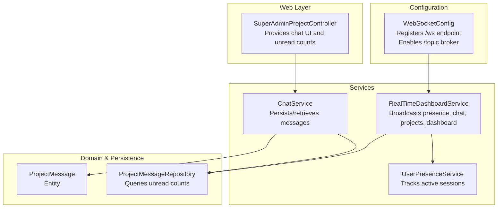
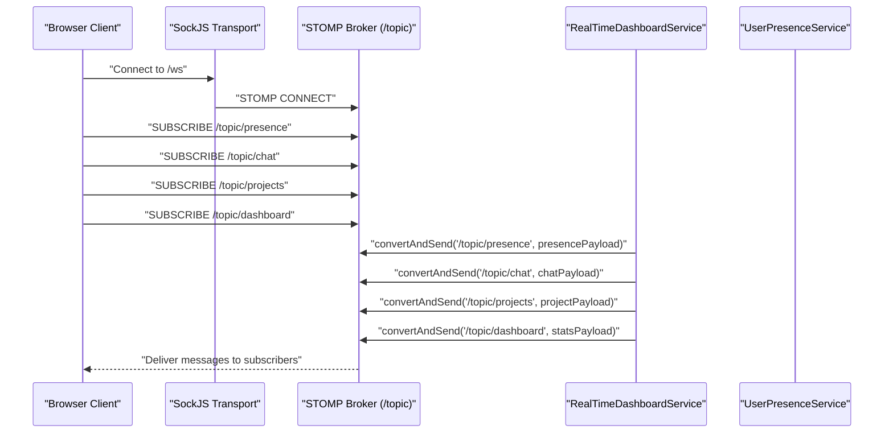
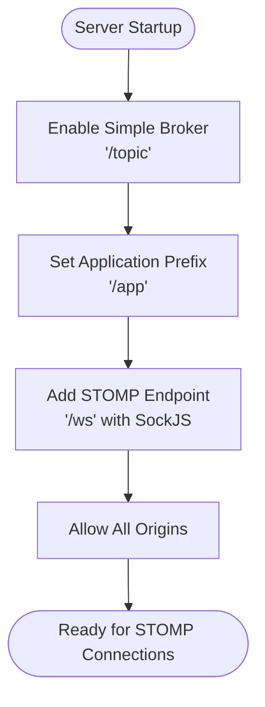
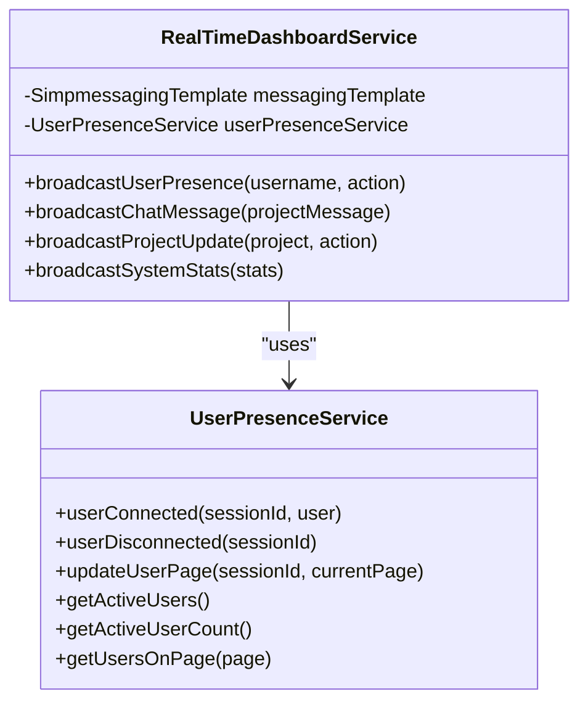
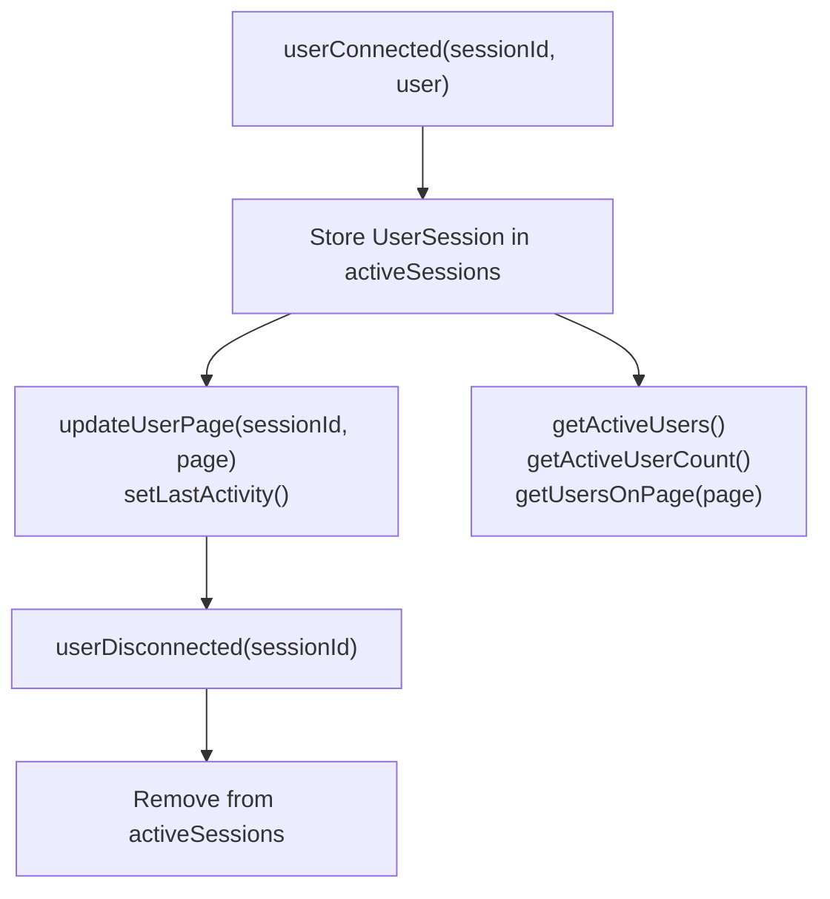
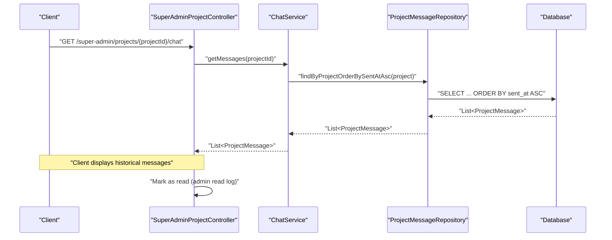
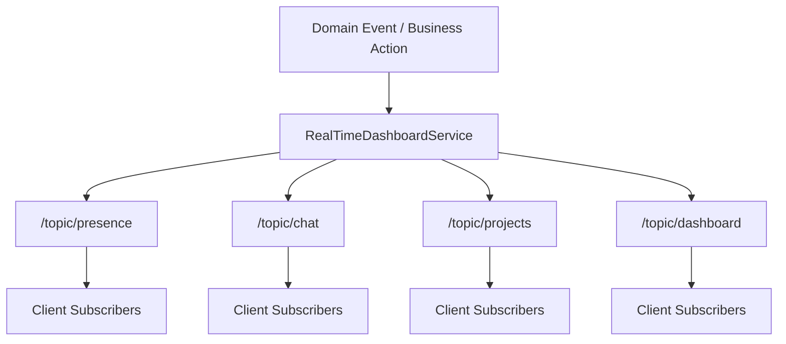
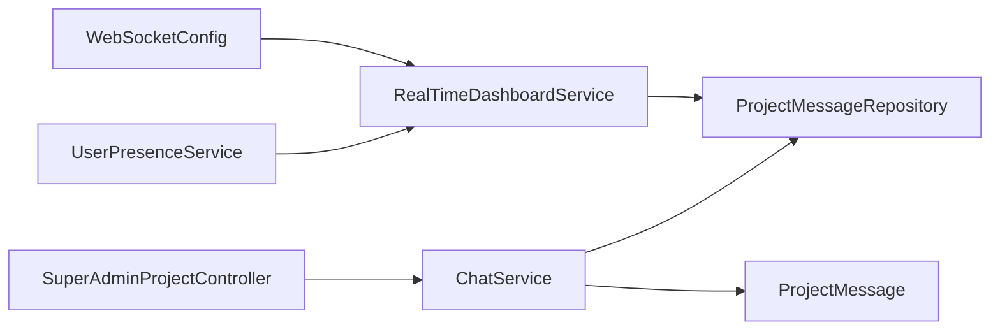

# WebSocket Real-time Communication

<cite>
**Referenced Files in This Document**
- [WebSocketConfig.java](file://src/main/java/root/cyb/mh/skylink_media_service/infrastructure/config/WebSocketConfig.java)
- [RealTimeDashboardService.java](file://src/main/java/root/cyb/mh/skylink_media_service/application/services/RealTimeDashboardService.java)
- [UserPresenceService.java](file://src/main/java/root/cyb/mh/skylink_media_service/application/services/UserPresenceService.java)
- [ChatService.java](file://src/main/java/root/cyb/mh/skylink_media_service/application/services/ChatService.java)
- [ProjectMessage.java](file://src/main/java/root/cyb/mh/skylink_media_service/domain/entities/ProjectMessage.java)
- [ProjectMessageRepository.java](file://src/main/java/root/cyb/mh/skylink_media_service/infrastructure/persistence/ProjectMessageRepository.java)
- [application.properties](file://src/main/resources/application.properties)
- [SuperAdminProjectController.java](file://src/main/java/root/cyb/mh/skylink_media_service/infrastructure/web/SuperAdminProjectController.java)
</cite>

## Table of Contents
1. [Introduction](#introduction)
2. [Project Structure](#project-structure)
3. [Core Components](#core-components)
4. [Architecture Overview](#architecture-overview)
5. [Detailed Component Analysis](#detailed-component-analysis)
6. [Dependency Analysis](#dependency-analysis)
7. [Performance Considerations](#performance-considerations)
8. [Troubleshooting Guide](#troubleshooting-guide)
9. [Conclusion](#conclusion)

## Introduction
This document explains the WebSocket real-time communication implementation in the backend service. It covers WebSocket configuration, STOMP endpoint registration, message broker setup, and the broadcasting mechanisms used for live updates. It also documents the chat service, user presence tracking, and subscription topics used by clients to receive real-time notifications such as live project updates, chat notifications, and user status changes. Guidance on connection lifecycle management, error handling, and scalability considerations is included.

## Project Structure
The WebSocket implementation is centered around a Spring configuration class that registers the STOMP endpoint and message broker, and a service layer that broadcasts real-time events to subscribed clients. Supporting components include a chat service for message persistence and retrieval, a presence tracking service for active users, and domain entities and repositories for chat data.

**Diagram sources**
- [WebSocketConfig.java:1-29](file://src/main/java/root/cyb/mh/skylink_media_service/infrastructure/config/WebSocketConfig.java#L1-L29)
- [RealTimeDashboardService.java:1-143](file://src/main/java/root/cyb/mh/skylink_media_service/application/services/RealTimeDashboardService.java#L1-L143)
- [UserPresenceService.java:1-147](file://src/main/java/root/cyb/mh/skylink_media_service/application/services/UserPresenceService.java#L1-L147)
- [ChatService.java:1-45](file://src/main/java/root/cyb/mh/skylink_media_service/application/services/ChatService.java#L1-L45)
- [ProjectMessage.java:1-84](file://src/main/java/root/cyb/mh/skylink_media_service/domain/entities/ProjectMessage.java#L1-L84)
- [ProjectMessageRepository.java:1-23](file://src/main/java/root/cyb/mh/skylink_media_service/infrastructure/persistence/ProjectMessageRepository.java#L1-L23)
- [SuperAdminProjectController.java:1-307](file://src/main/java/root/cyb/mh/skylink_media_service/infrastructure/web/SuperAdminProjectController.java#L1-L307)

**Section sources**
- [WebSocketConfig.java:1-29](file://src/main/java/root/cyb/mh/skylink_media_service/infrastructure/config/WebSocketConfig.java#L1-L29)
- [RealTimeDashboardService.java:1-143](file://src/main/java/root/cyb/mh/skylink_media_service/application/services/RealTimeDashboardService.java#L1-L143)
- [UserPresenceService.java:1-147](file://src/main/java/root/cyb/mh/skylink_media_service/application/services/UserPresenceService.java#L1-L147)
- [ChatService.java:1-45](file://src/main/java/root/cyb/mh/skylink_media_service/application/services/ChatService.java#L1-L45)
- [ProjectMessage.java:1-84](file://src/main/java/root/cyb/mh/skylink_media_service/domain/entities/ProjectMessage.java#L1-L84)
- [ProjectMessageRepository.java:1-23](file://src/main/java/root/cyb/mh/skylink_media_service/infrastructure/persistence/ProjectMessageRepository.java#L1-L23)
- [SuperAdminProjectController.java:1-307](file://src/main/java/root/cyb/mh/skylink_media_service/infrastructure/web/SuperAdminProjectController.java#L1-L307)

## Core Components
- WebSocket configuration: Registers the STOMP endpoint and enables a simple broker for topics.
- Real-time dashboard service: Broadcasts user presence, chat messages, project updates, and dashboard statistics.
- User presence service: Tracks active sessions and user activity for presence indicators.
- Chat service: Manages message creation, retrieval, and unread counts.
- Domain and persistence: ProjectMessage entity and repository for storing and querying chat messages.

Key responsibilities:
- WebSocketConfig: Exposes /ws endpoint with SockJS and sets up /topic as the broker destination.
- RealTimeDashboardService: Uses SimpMessagingTemplate to publish JSON payloads to /topic/* channels.
- UserPresenceService: Maintains concurrent session map and exposes presence metrics.
- ChatService: Persists messages and retrieves historical messages; computes unread counts via repository query.

**Section sources**
- [WebSocketConfig.java:13-27](file://src/main/java/root/cyb/mh/skylink_media_service/infrastructure/config/WebSocketConfig.java#L13-L27)
- [RealTimeDashboardService.java:19-108](file://src/main/java/root/cyb/mh/skylink_media_service/application/services/RealTimeDashboardService.java#L19-L108)
- [UserPresenceService.java:18-86](file://src/main/java/root/cyb/mh/skylink_media_service/application/services/UserPresenceService.java#L18-L86)
- [ChatService.java:24-43](file://src/main/java/root/cyb/mh/skylink_media_service/application/services/ChatService.java#L24-L43)
- [ProjectMessageRepository.java:16-19](file://src/main/java/root/cyb/mh/skylink_media_service/infrastructure/persistence/ProjectMessageRepository.java#L16-L19)

## Architecture Overview
The system uses Spring WebSocket with STOMP over SockJS. Clients connect to /ws and subscribe to topics under /topic. The backend publishes real-time events to these topics through a simple broker.

**Diagram sources**
- [WebSocketConfig.java:22-27](file://src/main/java/root/cyb/mh/skylink_media_service/infrastructure/config/WebSocketConfig.java#L22-L27)
- [RealTimeDashboardService.java:25-95](file://src/main/java/root/cyb/mh/skylink_media_service/application/services/RealTimeDashboardService.java#L25-L95)
- [UserPresenceService.java:48-68](file://src/main/java/root/cyb/mh/skylink_media_service/application/services/UserPresenceService.java#L48-L68)

## Detailed Component Analysis

### WebSocket Configuration
- Enables a simple memory-based broker for destinations prefixed with /topic.
- Sets application destination prefix to /app for message mappings.
- Registers STOMP endpoint at /ws with SockJS fallback and allows all origin patterns.

**Diagram sources**
- [WebSocketConfig.java:14-19](file://src/main/java/root/cyb/mh/skylink_media_service/infrastructure/config/WebSocketConfig.java#L14-L19)
- [WebSocketConfig.java:22-27](file://src/main/java/root/cyb/mh/skylink_media_service/infrastructure/config/WebSocketConfig.java#L22-L27)

**Section sources**
- [WebSocketConfig.java:13-27](file://src/main/java/root/cyb/mh/skylink_media_service/infrastructure/config/WebSocketConfig.java#L13-L27)

### Real-Time Dashboard Service
- Provides broadcast methods for:
  - User presence: broadcasts user join/leave and active user counts.
  - Chat messages: broadcasts new chat messages with project context.
  - Project updates: broadcasts project status changes.
  - Dashboard stats: broadcasts system metrics.
- Uses SimpMessagingTemplate to send JSON payloads to /topic/* destinations.
- Gracefully handles missing messaging template (no-op when WebSocket is unavailable).

**Diagram sources**
- [RealTimeDashboardService.java:19-108](file://src/main/java/root/cyb/mh/skylink_media_service/application/services/RealTimeDashboardService.java#L19-L108)
- [UserPresenceService.java:20-86](file://src/main/java/root/cyb/mh/skylink_media_service/application/services/UserPresenceService.java#L20-L86)

**Section sources**
- [RealTimeDashboardService.java:25-95](file://src/main/java/root/cyb/mh/skylink_media_service/application/services/RealTimeDashboardService.java#L25-L95)

### User Presence Tracking
- Tracks active sessions in a concurrent map keyed by session ID.
- Records user identity, role, connection time, last activity, and current page.
- Provides methods to compute active users, page-based counts, and filtered lists.

**Diagram sources**
- [UserPresenceService.java:20-86](file://src/main/java/root/cyb/mh/skylink_media_service/application/services/UserPresenceService.java#L20-L86)

**Section sources**
- [UserPresenceService.java:18-86](file://src/main/java/root/cyb/mh/skylink_media_service/application/services/UserPresenceService.java#L18-L86)

### Chat Service and Message Persistence
- Creates messages by associating a project and sender, persists them, and sets timestamps.
- Retrieves messages ordered by sent time.
- Computes unread message counts since a given timestamp for a user.

**Diagram sources**
- [SuperAdminProjectController.java:183-207](file://src/main/java/root/cyb/mh/skylink_media_service/infrastructure/web/SuperAdminProjectController.java#L183-L207)
- [ChatService.java:32-37](file://src/main/java/root/cyb/mh/skylink_media_service/application/services/ChatService.java#L32-L37)
- [ProjectMessageRepository.java:16](file://src/main/java/root/cyb/mh/skylink_media_service/infrastructure/persistence/ProjectMessageRepository.java#L16)

**Section sources**
- [ChatService.java:24-43](file://src/main/java/root/cyb/mh/skylink_media_service/application/services/ChatService.java#L24-L43)
- [ProjectMessageRepository.java:16-19](file://src/main/java/root/cyb/mh/skylink_media_service/infrastructure/persistence/ProjectMessageRepository.java#L16-L19)
- [ProjectMessage.java:28-31](file://src/main/java/root/cyb/mh/skylink_media_service/domain/entities/ProjectMessage.java#L28-L31)

### Message Handling Patterns and Subscription Management
- Topics:
  - /topic/presence: user presence events (join/leave, active counts).
  - /topic/chat: chat messages with project context.
  - /topic/projects: project status updates.
  - /topic/dashboard: system statistics.
- Clients subscribe to desired topics to receive targeted real-time updates.
- Payloads are JSON objects with a type field indicating the event category.

**Diagram sources**
- [RealTimeDashboardService.java:25-95](file://src/main/java/root/cyb/mh/skylink_media_service/application/services/RealTimeDashboardService.java#L25-L95)

**Section sources**
- [RealTimeDashboardService.java:25-95](file://src/main/java/root/cyb/mh/skylink_media_service/application/services/RealTimeDashboardService.java#L25-L95)

### Client-Server Communication Protocols
- Transport: WebSocket with SockJS fallback for broad browser compatibility.
- Protocol: STOMP over WebSocket/SockJS.
- Endpoints:
  - /ws: STOMP endpoint with SockJS enabled.
  - Destinations:
    - /app/chat: application-side message mapping (not shown in current files).
    - /topic/*: server-to-client broadcast destinations.

**Section sources**
- [WebSocketConfig.java:22-27](file://src/main/java/root/cyb/mh/skylink_media_service/infrastructure/config/WebSocketConfig.java#L22-L27)

## Dependency Analysis
The real-time subsystem depends on:
- WebSocketConfig for transport and broker setup.
- RealTimeDashboardService for publishing events to topics.
- UserPresenceService for presence metrics.
- ChatService and ProjectMessageRepository for chat data and unread counts.
- SuperAdminProjectController for UI integration and marking chats as read.

**Diagram sources**
- [WebSocketConfig.java:13-27](file://src/main/java/root/cyb/mh/skylink_media_service/infrastructure/config/WebSocketConfig.java#L13-L27)
- [RealTimeDashboardService.java:19-108](file://src/main/java/root/cyb/mh/skylink_media_service/application/services/RealTimeDashboardService.java#L19-L108)
- [UserPresenceService.java:18-86](file://src/main/java/root/cyb/mh/skylink_media_service/application/services/UserPresenceService.java#L18-L86)
- [ChatService.java:18-22](file://src/main/java/root/cyb/mh/skylink_media_service/application/services/ChatService.java#L18-L22)
- [ProjectMessageRepository.java:14-22](file://src/main/java/root/cyb/mh/skylink_media_service/infrastructure/persistence/ProjectMessageRepository.java#L14-L22)
- [ProjectMessage.java:6-31](file://src/main/java/root/cyb/mh/skylink_media_service/domain/entities/ProjectMessage.java#L6-L31)
- [SuperAdminProjectController.java:183-207](file://src/main/java/root/cyb/mh/skylink_media_service/infrastructure/web/SuperAdminProjectController.java#L183-L207)

**Section sources**
- [WebSocketConfig.java:13-27](file://src/main/java/root/cyb/mh/skylink_media_service/infrastructure/config/WebSocketConfig.java#L13-L27)
- [RealTimeDashboardService.java:19-108](file://src/main/java/root/cyb/mh/skylink_media_service/application/services/RealTimeDashboardService.java#L19-L108)
- [UserPresenceService.java:18-86](file://src/main/java/root/cyb/mh/skylink_media_service/application/services/UserPresenceService.java#L18-L86)
- [ChatService.java:18-22](file://src/main/java/root/cyb/mh/skylink_media_service/application/services/ChatService.java#L18-L22)
- [ProjectMessageRepository.java:14-22](file://src/main/java/root/cyb/mh/skylink_media_service/infrastructure/persistence/ProjectMessageRepository.java#L14-L22)
- [ProjectMessage.java:6-31](file://src/main/java/root/cyb/mh/skylink_media_service/domain/entities/ProjectMessage.java#L6-L31)
- [SuperAdminProjectController.java:183-207](file://src/main/java/root/cyb/mh/skylink_media_service/infrastructure/web/SuperAdminProjectController.java#L183-L207)

## Performance Considerations
- Memory-based broker: Suitable for development and small deployments; consider clustering or external brokers for production scale.
- Concurrent session tracking: UserPresenceService uses a concurrent map; monitor memory footprint with high concurrency.
- Broadcasting overhead: Limit unnecessary broadcasts; batch updates when appropriate.
- Database queries: Unread message counting uses a JPQL query; ensure proper indexing on project and sent_at columns.
- Transport choice: SockJS adds overhead; prefer native WebSocket in production where supported.

[No sources needed since this section provides general guidance]

## Troubleshooting Guide
Common issues and resolutions:
- No real-time updates:
  - Verify WebSocketConfig registered endpoint and allowed origins.
  - Confirm clients subscribe to correct topics.
  - Check that RealTimeDashboardService has a valid SimpMessagingTemplate.
- Presence not updating:
  - Ensure userConnected and userDisconnected are called during session lifecycle.
  - Validate session IDs and page updates.
- Chat not appearing:
  - Confirm ChatService persists messages and repository queries return results.
  - Verify broadcast method is invoked after message creation.
- CORS errors:
  - application.properties defines allowed origins; adjust as needed for your deployment.

**Section sources**
- [WebSocketConfig.java:22-27](file://src/main/java/root/cyb/mh/skylink_media_service/infrastructure/config/WebSocketConfig.java#L22-L27)
- [RealTimeDashboardService.java:25-33](file://src/main/java/root/cyb/mh/skylink_media_service/application/services/RealTimeDashboardService.java#L25-L33)
- [UserPresenceService.java:20-38](file://src/main/java/root/cyb/mh/skylink_media_service/application/services/UserPresenceService.java#L20-L38)
- [ChatService.java:24-30](file://src/main/java/root/cyb/mh/skylink_media_service/application/services/ChatService.java#L24-L30)
- [application.properties:37-41](file://src/main/resources/application.properties#L37-L41)

## Conclusion
The WebSocket implementation leverages Spring’s STOMP support with a simple broker to deliver real-time updates. The design cleanly separates concerns: configuration for transport and routing, services for broadcasting events, and repositories for data access. While functional for small-scale deployments, production readiness requires careful consideration of broker scaling, session management, and transport optimization.