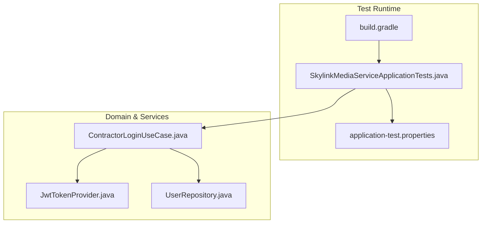
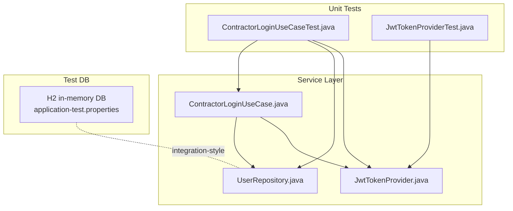
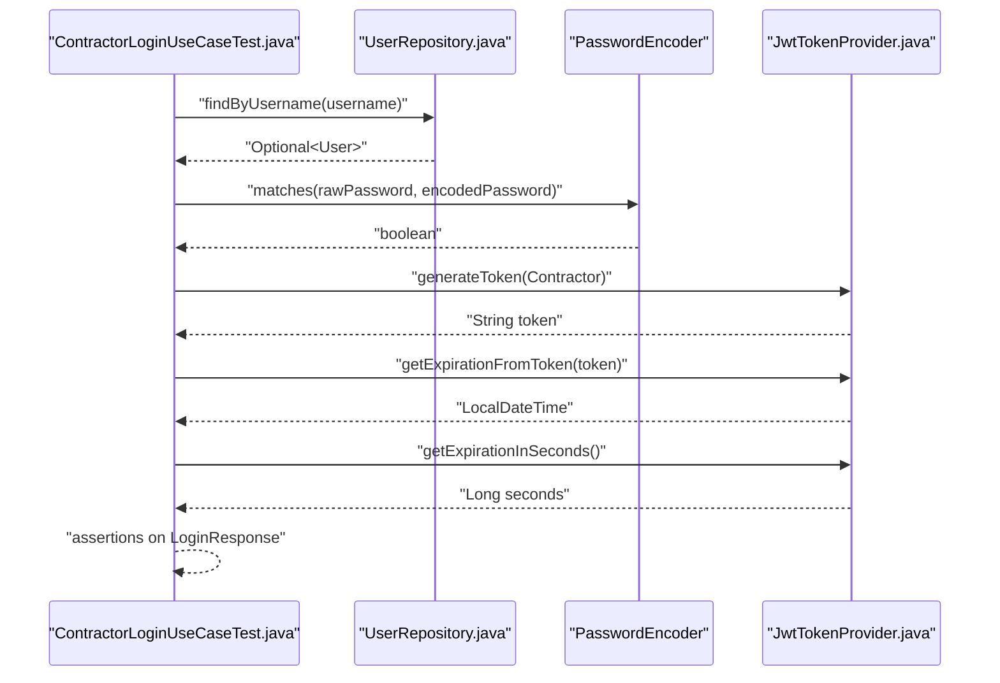
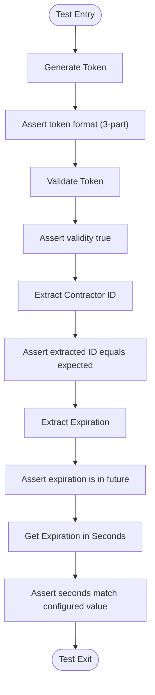
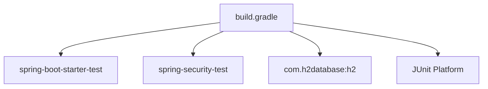

# Testing Strategy

<cite>
**Referenced Files in This Document**
- [SkylinkMediaServiceApplicationTests.java](file://src/test/java/root/cyb/mh/skylink_media_service/SkylinkMediaServiceApplicationTests.java)
- [application-test.properties](file://src/test/resources/application-test.properties)
- [build.gradle](file://build.gradle)
- [README.md](file://README.md)
- [ContractorLoginUseCase.java](file://src/main/java/root/cyb/mh/skylink_media_service/application/usecases/ContractorLoginUseCase.java)
- [ContractorLoginUseCaseTest.java](file://src/test/java/root/cyb/mh/skylink_media_service/application/usecases/ContractorLoginUseCaseTest.java)
- [JwtTokenProvider.java](file://src/main/java/root/cyb/mh/skylink_media_service/infrastructure/security/jwt/JwtTokenProvider.java)
- [JwtTokenProviderTest.java](file://src/test/java/root/cyb/mh/skylink_media_service/infrastructure/security/jwt/JwtTokenProviderTest.java)
- [UserRepository.java](file://src/main/java/root/cyb/mh/skylink_media_service/infrastructure/persistence/UserRepository.java)
- [application.properties](file://src/main/resources/application.properties)
</cite>

## Table of Contents
1. [Introduction](#introduction)
2. [Project Structure](#project-structure)
3. [Core Components](#core-components)
4. [Architecture Overview](#architecture-overview)
5. [Detailed Component Analysis](#detailed-component-analysis)
6. [Dependency Analysis](#dependency-analysis)
7. [Performance Considerations](#performance-considerations)
8. [Troubleshooting Guide](#troubleshooting-guide)
9. [Conclusion](#conclusion)
10. [Appendices](#appendices)

## Introduction
This document outlines the testing strategy for the Skylink Media Service backend. It covers unit testing with JUnit and Mockito for service-layer logic, integration testing approaches for database operations and API endpoints, and test configuration using application-test.properties. It also provides examples for authentication flows, business logic validation, and error handling scenarios, along with best practices, mock strategies, test data management, CI setup guidelines, and coverage expectations.

## Project Structure
The testing setup is organized around:
- Unit tests under src/test/java with JUnit 5 and Mockito
- Integration-style tests using an in-memory H2 database via application-test.properties
- Build configuration enabling JUnit Platform and test dependencies

**Diagram sources**
- [SkylinkMediaServiceApplicationTests.java:1-16](file://src/test/java/root/cyb/mh/skylink_media_service/SkylinkMediaServiceApplicationTests.java#L1-L16)
- [application-test.properties:1-9](file://src/test/resources/application-test.properties#L1-L9)
- [build.gradle:49-52](file://build.gradle#L49-L52)
- [ContractorLoginUseCase.java:1-60](file://src/main/java/root/cyb/mh/skylink_media_service/application/usecases/ContractorLoginUseCase.java#L1-L60)
- [JwtTokenProvider.java:1-81](file://src/main/java/root/cyb/mh/skylink_media_service/infrastructure/security/jwt/JwtTokenProvider.java#L1-L81)
- [UserRepository.java:1-22](file://src/main/java/root/cyb/mh/skylink_media_service/infrastructure/persistence/UserRepository.java#L1-L22)

**Section sources**
- [SkylinkMediaServiceApplicationTests.java:1-16](file://src/test/java/root/cyb/mh/skylink_media_service/SkylinkMediaServiceApplicationTests.java#L1-L16)
- [application-test.properties:1-9](file://src/test/resources/application-test.properties#L1-L9)
- [build.gradle:49-52](file://build.gradle#L49-L52)
- [README.md:156-164](file://README.md#L156-L164)

## Core Components
- Unit testing framework: JUnit 5 with Mockito for mocking collaborators
- Test configuration: application-test.properties defines an in-memory H2 database and JPA DDL behavior for fast, isolated tests
- Test execution: Gradle task configured to use JUnit Platform

Key capabilities validated by tests:
- Authentication flow: username/password validation, contractor role gating, JWT issuance and parsing
- Business logic: contractor login use case behavior and error conditions
- Token provider: token generation, validation, expiration extraction, and ID retrieval

**Section sources**
- [ContractorLoginUseCaseTest.java:1-118](file://src/test/java/root/cyb/mh/skylink_media_service/application/usecases/ContractorLoginUseCaseTest.java#L1-L118)
- [JwtTokenProviderTest.java:1-80](file://src/test/java/root/cyb/mh/skylink_media_service/infrastructure/security/jwt/JwtTokenProviderTest.java#L1-L80)
- [application-test.properties:1-9](file://src/test/resources/application-test.properties#L1-L9)
- [build.gradle:34-37](file://build.gradle#L34-L37)

## Architecture Overview
The test architecture separates concerns:
- Service-layer unit tests validate business logic in isolation using mocks
- Token provider tests validate cryptographic token operations without external dependencies
- Integration-style tests leverage an in-memory database to exercise repositories and persistence behavior

**Diagram sources**
- [ContractorLoginUseCaseTest.java:25-38](file://src/test/java/root/cyb/mh/skylink_media_service/application/usecases/ContractorLoginUseCaseTest.java#L25-L38)
- [JwtTokenProviderTest.java:12-25](file://src/test/java/root/cyb/mh/skylink_media_service/infrastructure/security/jwt/JwtTokenProviderTest.java#L12-L25)
- [ContractorLoginUseCase.java:17-28](file://src/main/java/root/cyb/mh/skylink_media_service/application/usecases/ContractorLoginUseCase.java#L17-L28)
- [JwtTokenProvider.java:16-24](file://src/main/java/root/cyb/mh/skylink_media_service/infrastructure/security/jwt/JwtTokenProvider.java#L16-L24)
- [UserRepository.java:12-22](file://src/main/java/root/cyb/mh/skylink_media_service/infrastructure/persistence/UserRepository.java#L12-L22)
- [application-test.properties:2-8](file://src/test/resources/application-test.properties#L2-L8)

## Detailed Component Analysis

### Authentication Flow Testing
This section documents the approach to testing contractor login, including successful login, invalid username, invalid password, and non-contractor user scenarios.

**Diagram sources**
- [ContractorLoginUseCaseTest.java:49-69](file://src/test/java/root/cyb/mh/skylink_media_service/application/usecases/ContractorLoginUseCaseTest.java#L49-L69)
- [ContractorLoginUseCase.java:29-58](file://src/main/java/root/cyb/mh/skylink_media_service/application/usecases/ContractorLoginUseCase.java#L29-L58)
- [UserRepository.java:13-14](file://src/main/java/root/cyb/mh/skylink_media_service/infrastructure/persistence/UserRepository.java#L13-L14)
- [JwtTokenProvider.java:25-74](file://src/main/java/root/cyb/mh/skylink_media_service/infrastructure/security/jwt/JwtTokenProvider.java#L25-L74)

Key assertions and verifications covered:
- Successful login returns a non-null token with expected type and metadata
- Invalid username triggers a credential error without invoking password checks
- Invalid password triggers a credential error and prevents token generation
- Non-contractor users trigger a credential error even with correct credentials

Best practices demonstrated:
- Mock repository, encoder, and token provider independently
- Verify interactions to ensure collaborators are called appropriately
- Use parameterized assertions to validate response fields

**Section sources**
- [ContractorLoginUseCaseTest.java:49-116](file://src/test/java/root/cyb/mh/skylink_media_service/application/usecases/ContractorLoginUseCaseTest.java#L49-L116)
- [ContractorLoginUseCase.java:29-58](file://src/main/java/root/cyb/mh/skylink_media_service/application/usecases/ContractorLoginUseCase.java#L29-L58)

### JWT Provider Testing
This section focuses on validating token generation, validation, and extraction of claims.

**Diagram sources**
- [JwtTokenProviderTest.java:27-78](file://src/test/java/root/cyb/mh/skylink_media_service/infrastructure/security/jwt/JwtTokenProviderTest.java#L27-L78)
- [JwtTokenProvider.java:25-74](file://src/main/java/root/cyb/mh/skylink_media_service/infrastructure/security/jwt/JwtTokenProvider.java#L25-L74)

Coverage highlights:
- Token generation produces a valid JWT structure
- Token validation succeeds for valid tokens and fails for invalid ones
- Claims extraction works for contractor ID and expiration timestamps
- Expiration in seconds aligns with configured JWT expiration

**Section sources**
- [JwtTokenProviderTest.java:27-78](file://src/test/java/root/cyb/mh/skylink_media_service/infrastructure/security/jwt/JwtTokenProviderTest.java#L27-L78)
- [JwtTokenProvider.java:25-74](file://src/main/java/root/cyb/mh/skylink_media_service/infrastructure/security/jwt/JwtTokenProvider.java#L25-L74)

### Repository and Persistence Testing
Integration-style tests can validate repository behavior against the in-memory database.

Recommended scenarios:
- Save and load user by username
- Existence checks for usernames
- Type-based queries using user polymorphic types
- Counting blocked users

Configuration reference:
- H2 in-memory datasource with auto DDL drop-create
- H2 console enabled for inspection during development

**Section sources**
- [application-test.properties:2-8](file://src/test/resources/application-test.properties#L2-L8)
- [UserRepository.java:13-21](file://src/main/java/root/cyb/mh/skylink_media_service/infrastructure/persistence/UserRepository.java#L13-L21)

### API Endpoint Testing
While dedicated controller tests are not present in the current repository snapshot, the testing strategy supports endpoint validation through:
- Spring Boot test slices with @WebMvcTest or full @SpringBootTest
- RestAssured or Spring MVC Test for HTTP-level assertions
- Test containers for real database integration if needed

Guidelines:
- Use @ActiveProfiles("test") to activate test configuration
- Mock service beans to isolate HTTP layer tests
- Validate status codes, JSON bodies, and headers

[No sources needed since this section provides general guidance]

## Dependency Analysis
The test dependencies and runtime configuration are defined in the Gradle build file and activated by the test application context.

**Diagram sources**
- [build.gradle:34-37](file://build.gradle#L34-L37)
- [build.gradle:49-52](file://build.gradle#L49-L52)

**Section sources**
- [build.gradle:34-37](file://build.gradle#L34-L37)
- [build.gradle:49-52](file://build.gradle#L49-L52)

## Performance Considerations
- Prefer unit tests with mocks for speed; reserve integration tests for critical paths
- Use in-memory H2 for database tests to avoid disk I/O overhead
- Keep test data minimal and deterministic; reuse fixtures where appropriate
- Avoid heavy initialization in @BeforeEach; prefer lazy setup per test method

[No sources needed since this section provides general guidance]

## Troubleshooting Guide
Common issues and resolutions:
- Test database connectivity errors: verify H2 driver and URL in application-test.properties
- JWT validation failures: ensure test secrets and expiration values are set consistently
- Credential errors in login tests: confirm PasswordEncoder behavior and hashed passwords used in mocks
- Token parsing exceptions: validate signing key derivation and token structure

**Section sources**
- [application-test.properties:2-8](file://src/test/resources/application-test.properties#L2-L8)
- [JwtTokenProvider.java:19-23](file://src/main/java/root/cyb/mh/skylink_media_service/infrastructure/security/jwt/JwtTokenProvider.java#L19-L23)
- [ContractorLoginUseCaseTest.java:50-98](file://src/test/java/root/cyb/mh/skylink_media_service/application/usecases/ContractorLoginUseCaseTest.java#L50-L98)

## Conclusion
The Skylink Media Service employs a pragmatic testing strategy combining unit tests with JUnit and Mockito, robust JWT provider validation, and integration-style tests backed by an H2 in-memory database. This approach ensures reliable authentication flows, clear business logic validation, and maintainable test suites suitable for continuous integration pipelines.

[No sources needed since this section summarizes without analyzing specific files]

## Appendices

### Test Configuration Reference
- Profile activation: @ActiveProfiles("test")
- Test database: H2 in-memory with auto DDL drop-create
- H2 console enabled for debugging

**Section sources**
- [SkylinkMediaServiceApplicationTests.java:7-8](file://src/test/java/root/cyb/mh/skylink_media_service/SkylinkMediaServiceApplicationTests.java#L7-L8)
- [application-test.properties:2-8](file://src/test/resources/application-test.properties#L2-L8)

### Continuous Integration Setup
- Trigger tests on pull requests and merges
- Use Gradle Wrapper for reproducible builds
- Publish test reports and coverage metrics (if configured)

**Section sources**
- [build.gradle:49-52](file://build.gradle#L49-L52)
- [README.md:158-161](file://README.md#L158-L161)

### Test Coverage Expectations
- Aim for high coverage in service-layer logic and critical business rules
- Ensure authentication and authorization flows are fully covered
- Maintain coverage for error paths and boundary conditions

[No sources needed since this section provides general guidance]