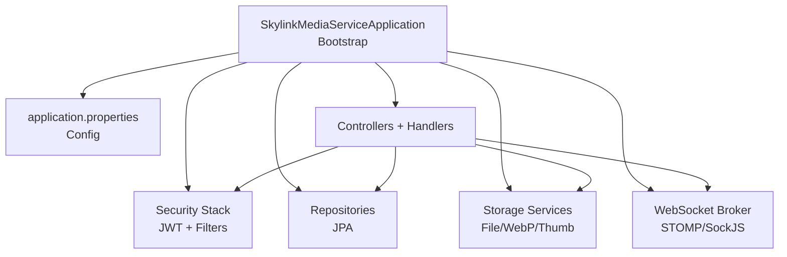
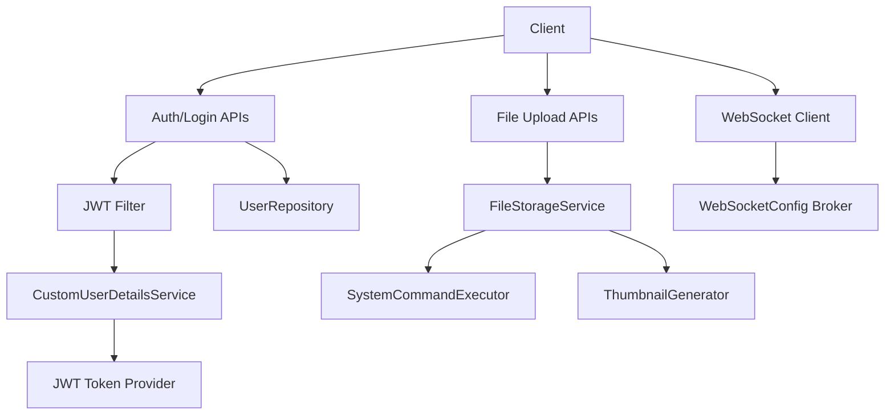
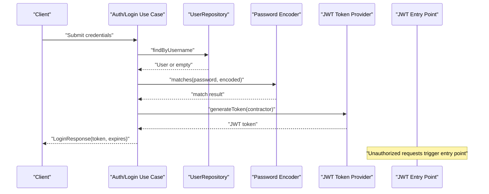
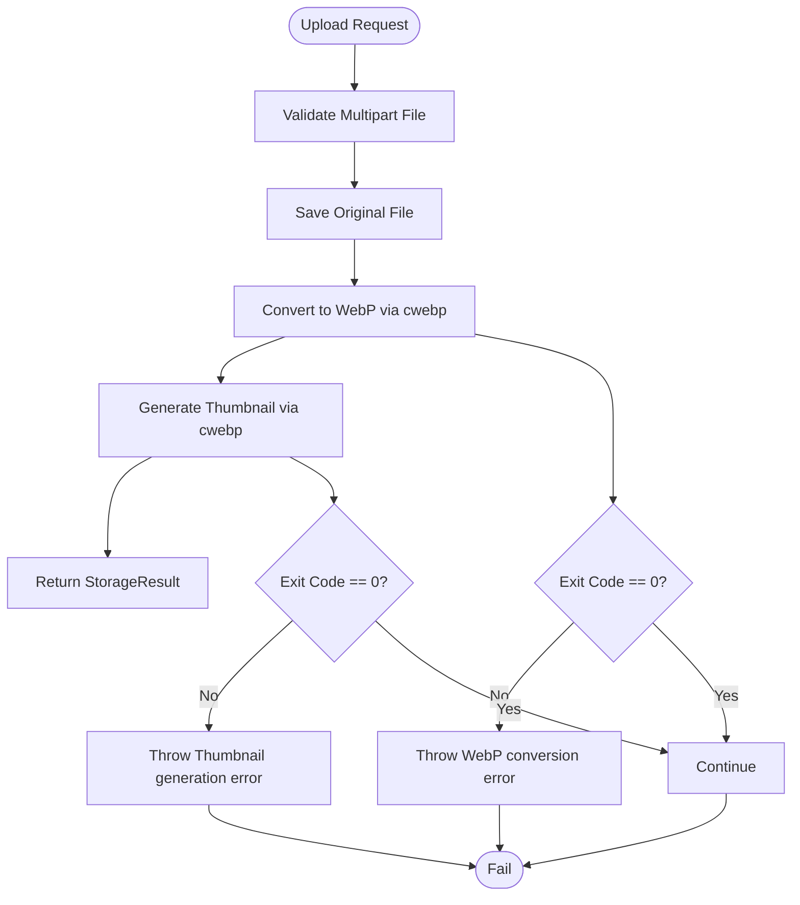
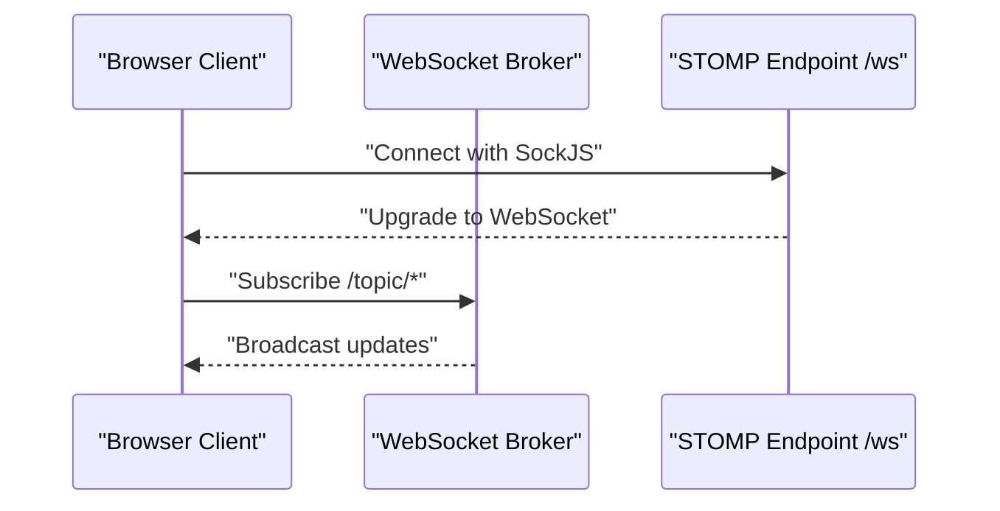
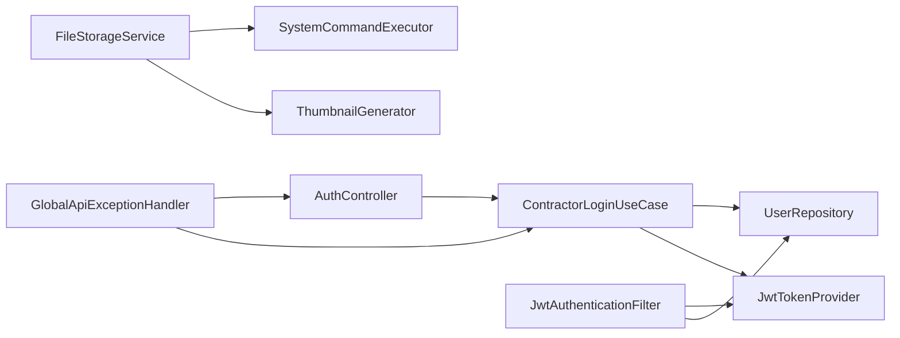

# Troubleshooting & FAQ

<cite>
**Referenced Files in This Document**
- [SkylinkMediaServiceApplication.java](file://src/main/java/root/cyb/mh/skylink_media_service/SkylinkMediaServiceApplication.java)
- [application.properties](file://src/main/resources/application.properties)
- [JwtAuthenticationEntryPoint.java](file://src/main/java/root/cyb/mh/skylink_media_service/infrastructure/security/Jwt/JwtAuthenticationEntryPoint.java)
- [JwtAuthenticationFilter.java](file://src/main/java/root/cyb/mh/skylink_media_service/infrastructure/security/Jwt/JwtAuthenticationFilter.java)
- [JwtTokenProvider.java](file://src/main/java/root/cyb/mh/skylink_media_service/infrastructure/security/Jwt/JwtTokenProvider.java)
- [CustomUserDetailsService.java](file://src/main/java/root/cyb/mh/skylink_media_service/infrastructure/security/CustomUserDetailsService.java)
- [ContractorLoginUseCase.java](file://src/main/java/root/cyb/mh/skylink_media_service/application/usecases/ContractorLoginUseCase.java)
- [AuthController.java](file://src/main/java/root/cyb/mh/skylink_media_service/infrastructure/web/AuthController.java)
- [GlobalApiExceptionHandler.java](file://src/main/java/root/cyb/mh/skylink_media_service/infrastructure/web/api/exception/GlobalApiExceptionHandler.java)
- [FileStorageService.java](file://src/main/java/root/cyb/mh/skylink_media_service/infrastructure/storage/FileStorageService.java)
- [ThumbnailGenerator.java](file://src/main/java/root/cyb/mh/skylink_media_service/infrastructure/storage/ThumbnailGenerator.java)
- [SystemCommandExecutor.java](file://src/main/java/root/cyb/mh/skylink_media_service/infrastructure/storage/SystemCommandExecutor.java)
- [WebSocketConfig.java](file://src/main/java/root/cyb/mh/skylink_media_service/infrastructure/config/WebSocketConfig.java)
- [UserRepository.java](file://src/main/java/root/cyb/mh/skylink_media_service/infrastructure/persistence/UserRepository.java)
- [User.java](file://src/main/java/root/cyb/mh/skylink_media_service/domain/entities/User.java)
</cite>

## Table of Contents
1. [Introduction](#introduction)
2. [Project Structure](#project-structure)
3. [Core Components](#core-components)
4. [Architecture Overview](#architecture-overview)
5. [Detailed Component Analysis](#detailed-component-analysis)
6. [Dependency Analysis](#dependency-analysis)
7. [Performance Considerations](#performance-considerations)
8. [Troubleshooting Guide](#troubleshooting-guide)
9. [FAQ](#faq)
10. [Conclusion](#conclusion)

## Introduction
This document provides comprehensive troubleshooting and FAQ guidance for the Skylink Media Service backend. It focuses on diagnosing and resolving common issues such as authentication failures, database connectivity problems, file upload failures, WebSocket connection issues, image processing errors, and API authentication failures. It also covers performance tuning, memory optimization, scalability considerations, and operational diagnostics for both development and production environments.

## Project Structure
The backend is a Spring Boot application with layered architecture:
- Application bootstrap and scheduling/async enablement
- Configuration via application.properties
- Security stack: JWT authentication, filters, and user details service
- Persistence via Spring Data JPA repositories
- Storage subsystem for uploads, WebP conversion, and thumbnails
- WebSocket messaging broker configuration
- Global API exception handling

**Diagram sources**
- [SkylinkMediaServiceApplication.java:1-18](file://src/main/java/root/cyb/mh/skylink_media_service/SkylinkMediaServiceApplication.java#L1-L18)
- [application.properties:1-58](file://src/main/resources/application.properties#L1-L58)

**Section sources**
- [SkylinkMediaServiceApplication.java:1-18](file://src/main/java/root/cyb/mh/skylink_media_service/SkylinkMediaServiceApplication.java#L1-L18)
- [application.properties:1-58](file://src/main/resources/application.properties#L1-L58)

## Core Components
- Authentication and Authorization
  - JWT token provider and filter
  - Custom user details service and entry point
  - Login use case and controller routing
- Persistence
  - UserRepository and base User entity
- Storage
  - FileStorageService orchestrating WebP conversion and thumbnail generation
  - SystemCommandExecutor and ThumbnailGenerator delegating to external tools
- Messaging
  - WebSocketConfig enabling STOMP over SockJS
- API Error Handling
  - GlobalApiExceptionHandler centralizing error responses

**Section sources**
- [JwtTokenProvider.java:1-81](file://src/main/java/root/cyb/mh/skylink_media_service/infrastructure/security/Jwt/JwtTokenProvider.java#L1-L81)
- [JwtAuthenticationFilter.java:1-70](file://src/main/java/root/cyb/mh/skylink_media_service/infrastructure/security/Jwt/JwtAuthenticationFilter.java#L1-L70)
- [CustomUserDetailsService.java:1-36](file://src/main/java/root/cyb/mh/skylink_media_service/infrastructure/security/CustomUserDetailsService.java#L1-L36)
- [ContractorLoginUseCase.java:1-60](file://src/main/java/root/cyb/mh/skylink_media_service/application/usecases/ContractorLoginUseCase.java#L1-L60)
- [UserRepository.java:1-22](file://src/main/java/root/cyb/mh/skylink_media_service/infrastructure/persistence/UserRepository.java#L1-L22)
- [User.java:1-82](file://src/main/java/root/cyb/mh/skylink_media_service/domain/entities/User.java#L1-L82)
- [FileStorageService.java:1-89](file://src/main/java/root/cyb/mh/skylink_media_service/infrastructure/storage/FileStorageService.java#L1-L89)
- [SystemCommandExecutor.java:1-32](file://src/main/java/root/cyb/mh/skylink_media_service/infrastructure/storage/SystemCommandExecutor.java#L1-L32)
- [ThumbnailGenerator.java:1-42](file://src/main/java/root/cyb/mh/skylink_media_service/infrastructure/storage/ThumbnailGenerator.java#L1-L42)
- [WebSocketConfig.java:1-29](file://src/main/java/root/cyb/mh/skylink_media_service/infrastructure/config/WebSocketConfig.java#L1-L29)
- [GlobalApiExceptionHandler.java:1-84](file://src/main/java/root/cyb/mh/skylink_media_service/infrastructure/web/api/exception/GlobalApiExceptionHandler.java#L1-L84)

## Architecture Overview
High-level runtime flow for authentication, storage, and messaging:

**Diagram sources**
- [JwtAuthenticationFilter.java:32-54](file://src/main/java/root/cyb/mh/skylink_media_service/infrastructure/security/Jwt/JwtAuthenticationFilter.java#L32-L54)
- [CustomUserDetailsService.java:19-34](file://src/main/java/root/cyb/mh/skylink_media_service/infrastructure/security/CustomUserDetailsService.java#L19-L34)
- [JwtTokenProvider.java:25-37](file://src/main/java/root/cyb/mh/skylink_media_service/infrastructure/security/Jwt/JwtTokenProvider.java#L25-L37)
- [UserRepository.java:13-18](file://src/main/java/root/cyb/mh/skylink_media_service/infrastructure/persistence/UserRepository.java#L13-L18)
- [FileStorageService.java:33-55](file://src/main/java/root/cyb/mh/skylink_media_service/infrastructure/storage/FileStorageService.java#L33-L55)
- [SystemCommandExecutor.java:11-30](file://src/main/java/root/cyb/mh/skylink_media_service/infrastructure/storage/SystemCommandExecutor.java#L11-L30)
- [ThumbnailGenerator.java:17-40](file://src/main/java/root/cyb/mh/skylink_media_service/infrastructure/storage/ThumbnailGenerator.java#L17-L40)
- [WebSocketConfig.java:13-27](file://src/main/java/root/cyb/mh/skylink_media_service/infrastructure/config/WebSocketConfig.java#L13-L27)

## Detailed Component Analysis

### Authentication Flow (JWT)

**Diagram sources**
- [ContractorLoginUseCase.java:29-58](file://src/main/java/root/cyb/mh/skylink_media_service/application/usecases/ContractorLoginUseCase.java#L29-L58)
- [UserRepository.java:13-14](file://src/main/java/root/cyb/mh/skylink_media_service/infrastructure/persistence/UserRepository.java#L13-L14)
- [JwtTokenProvider.java:25-37](file://src/main/java/root/cyb/mh/skylink_media_service/infrastructure/security/Jwt/JwtTokenProvider.java#L25-L37)
- [JwtAuthenticationEntryPoint.java:20-34](file://src/main/java/root/cyb/mh/skylink_media_service/infrastructure/security/Jwt/JwtAuthenticationEntryPoint.java#L20-L34)

**Section sources**
- [ContractorLoginUseCase.java:1-60](file://src/main/java/root/cyb/mh/skylink_media_service/application/usecases/ContractorLoginUseCase.java#L1-L60)
- [UserRepository.java:1-22](file://src/main/java/root/cyb/mh/skylink_media_service/infrastructure/persistence/UserRepository.java#L1-L22)
- [JwtTokenProvider.java:1-81](file://src/main/java/root/cyb/mh/skylink_media_service/infrastructure/security/Jwt/JwtTokenProvider.java#L1-L81)
- [JwtAuthenticationEntryPoint.java:1-36](file://src/main/java/root/cyb/mh/skylink_media_service/infrastructure/security/Jwt/JwtAuthenticationEntryPoint.java#L1-L36)

### File Upload and Image Processing Pipeline

**Diagram sources**
- [FileStorageService.java:33-55](file://src/main/java/root/cyb/mh/skylink_media_service/infrastructure/storage/FileStorageService.java#L33-L55)
- [SystemCommandExecutor.java:11-30](file://src/main/java/root/cyb/mh/skylink_media_service/infrastructure/storage/SystemCommandExecutor.java#L11-L30)
- [ThumbnailGenerator.java:17-40](file://src/main/java/root/cyb/mh/skylink_media_service/infrastructure/storage/ThumbnailGenerator.java#L17-L40)

**Section sources**
- [FileStorageService.java:1-89](file://src/main/java/root/cyb/mh/skylink_media_service/infrastructure/storage/FileStorageService.java#L1-L89)
- [SystemCommandExecutor.java:1-32](file://src/main/java/root/cyb/mh/skylink_media_service/infrastructure/storage/SystemCommandExecutor.java#L1-L32)
- [ThumbnailGenerator.java:1-42](file://src/main/java/root/cyb/mh/skylink_media_service/infrastructure/storage/ThumbnailGenerator.java#L1-L42)

### WebSocket Messaging Setup

**Diagram sources**
- [WebSocketConfig.java:13-27](file://src/main/java/root/cyb/mh/skylink_media_service/infrastructure/config/WebSocketConfig.java#L13-L27)

**Section sources**
- [WebSocketConfig.java:1-29](file://src/main/java/root/cyb/mh/skylink_media_service/infrastructure/config/WebSocketConfig.java#L1-L29)

## Dependency Analysis
Key internal dependencies:
- Controllers depend on use cases/services
- Use cases depend on repositories and JWT provider
- Storage services depend on command executor and thumbnail generator
- Security filter depends on token provider and repository
- Exception handler centralizes error responses

**Diagram sources**
- [AuthController.java:11-26](file://src/main/java/root/cyb/mh/skylink_media_service/infrastructure/web/AuthController.java#L11-L26)
- [ContractorLoginUseCase.java:29-58](file://src/main/java/root/cyb/mh/skylink_media_service/application/usecases/ContractorLoginUseCase.java#L29-L58)
- [UserRepository.java:13-18](file://src/main/java/root/cyb/mh/skylink_media_service/infrastructure/persistence/UserRepository.java#L13-L18)
- [JwtAuthenticationFilter.java:32-54](file://src/main/java/root/cyb/mh/skylink_media_service/infrastructure/security/Jwt/JwtAuthenticationFilter.java#L32-L54)
- [FileStorageService.java:33-55](file://src/main/java/root/cyb/mh/skylink_media_service/infrastructure/storage/FileStorageService.java#L33-L55)
- [GlobalApiExceptionHandler.java:17-84](file://src/main/java/root/cyb/mh/skylink_media_service/infrastructure/web/api/exception/GlobalApiExceptionHandler.java#L17-L84)

**Section sources**
- [AuthController.java:1-28](file://src/main/java/root/cyb/mh/skylink_media_service/infrastructure/web/AuthController.java#L1-L28)
- [ContractorLoginUseCase.java:1-60](file://src/main/java/root/cyb/mh/skylink_media_service/application/usecases/ContractorLoginUseCase.java#L1-L60)
- [UserRepository.java:1-22](file://src/main/java/root/cyb/mh/skylink_media_service/infrastructure/persistence/UserRepository.java#L1-L22)
- [JwtAuthenticationFilter.java:1-70](file://src/main/java/root/cyb/mh/skylink_media_service/infrastructure/security/Jwt/JwtAuthenticationFilter.java#L1-L70)
- [FileStorageService.java:1-89](file://src/main/java/root/cyb/mh/skylink_media_service/infrastructure/storage/FileStorageService.java#L1-L89)
- [GlobalApiExceptionHandler.java:1-84](file://src/main/java/root/cyb/mh/skylink_media_service/infrastructure/web/api/exception/GlobalApiExceptionHandler.java#L1-L84)

## Performance Considerations
- Asynchronous and scheduled tasks are enabled at the application level. Ensure task queues and thread pools are sized appropriately for production loads.
- File processing relies on external cwebp binaries. Monitor CPU and disk I/O during bulk uploads.
- JWT token validation is lightweight but still adds overhead per request; consider caching roles and minimizing unnecessary validations.
- WebSocket memory broker is in-memory; for horizontal scaling, external brokers (Redis) are recommended.
- Database DDL auto-update is enabled; avoid in production and manage migrations explicitly.

[No sources needed since this section provides general guidance]

## Troubleshooting Guide

### Authentication Problems
Symptoms:
- 401 Unauthorized on protected endpoints
- “Authentication required” responses
- Login failures despite correct credentials

Debug steps:
1. Verify Authorization header format: Bearer <token>
2. Confirm token validity and expiration via token provider
3. Ensure user is not blocked in the database
4. Check that the filter applies only to /api/v1 paths
5. Validate JWT secret and expiration settings

Resolution strategies:
- Regenerate token after verifying credentials
- Unblock user if blocked
- Adjust JWT expiration and secret in configuration
- Confirm filter chain excludes non-API paths

**Section sources**
- [JwtAuthenticationEntryPoint.java:20-34](file://src/main/java/root/cyb/mh/skylink_media_service/infrastructure/security/Jwt/JwtAuthenticationEntryPoint.java#L20-L34)
- [JwtAuthenticationFilter.java:32-60](file://src/main/java/root/cyb/mh/skylink_media_service/infrastructure/security/Jwt/JwtAuthenticationFilter.java#L32-L60)
- [JwtTokenProvider.java:39-48](file://src/main/java/root/cyb/mh/skylink_media_service/infrastructure/security/Jwt/JwtTokenProvider.java#L39-L48)
- [CustomUserDetailsService.java:24-27](file://src/main/java/root/cyb/mh/skylink_media_service/infrastructure/security/CustomUserDetailsService.java#L24-L27)
- [application.properties:27-31](file://src/main/resources/application.properties#L27-L31)

### Database Connection Errors
Symptoms:
- Application fails to start
- JPA/Hibernate errors
- Cannot connect to PostgreSQL

Debug steps:
1. Verify datasource URL, username, and password
2. Confirm PostgreSQL is reachable on the configured port
3. Check network/firewall rules
4. Review Hibernate dialect and DDL auto settings

Resolution strategies:
- Fix credentials and URL
- Allow inbound connections to PostgreSQL
- Disable DDL auto-update in production
- Use explicit migration scripts

**Section sources**
- [application.properties:3-9](file://src/main/resources/application.properties#L3-L9)

### File Upload Failures
Symptoms:
- Uploads fail silently or partially
- WebP conversion errors
- Thumbnail generation errors

Debug steps:
1. Confirm upload directory exists and is writable
2. Verify max-file-size and max-request-size limits
3. Check cwebp availability and permissions
4. Inspect logs for conversion/thumbnail errors

Resolution strategies:
- Increase multipart limits if needed
- Install/fix cwebp binary and ensure PATH
- Validate disk space and permissions
- Retry conversions on transient failures

**Section sources**
- [application.properties:12-15](file://src/main/resources/application.properties#L12-L15)
- [FileStorageService.java:33-55](file://src/main/java/root/cyb/mh/skylink_media_service/infrastructure/storage/FileStorageService.java#L33-L55)
- [SystemCommandExecutor.java:11-30](file://src/main/java/root/cyb/mh/skylink_media_service/infrastructure/storage/SystemCommandExecutor.java#L11-L30)
- [ThumbnailGenerator.java:17-40](file://src/main/java/root/cyb/mh/skylink_media_service/infrastructure/storage/ThumbnailGenerator.java#L17-L40)

### WebSocket Connection Issues
Symptoms:
- Clients cannot connect to /ws
- No broadcast messages received

Debug steps:
1. Confirm STOMP endpoint registration
2. Verify allowed origins/patterns
3. Test SockJS fallback
4. Check browser console/network tab

Resolution strategies:
- Align client origin with allowed patterns
- Use proper STOMP subscription prefixes
- For clustering, switch from in-memory to Redis-backed broker

**Section sources**
- [WebSocketConfig.java:22-27](file://src/main/java/root/cyb/mh/skylink_media_service/infrastructure/config/WebSocketConfig.java#L22-L27)
- [application.properties:37-41](file://src/main/resources/application.properties#L37-L41)

### API Authentication Failures
Symptoms:
- 401 Unauthorized responses
- Validation errors on login

Debug steps:
1. Confirm login request payload and validation
2. Check exception handler mappings
3. Verify user existence and role

Resolution strategies:
- Fix validation errors reported in the error body
- Ensure contractor role and credentials
- Centralized error responses help diagnose causes

**Section sources**
- [ContractorLoginUseCase.java:29-58](file://src/main/java/root/cyb/mh/skylink_media_service/application/usecases/ContractorLoginUseCase.java#L29-L58)
- [GlobalApiExceptionHandler.java:42-54](file://src/main/java/root/cyb/mh/skylink_media_service/infrastructure/web/api/exception/GlobalApiExceptionHandler.java#L42-L54)

### Image Processing Errors
Symptoms:
- Conversion or thumbnail generation failures
- Empty or corrupted images

Debug steps:
1. Capture exit codes and error streams
2. Validate input file type and metadata
3. Check cwebp version compatibility

Resolution strategies:
- Re-run conversion with compatible parameters
- Normalize input files before processing
- Add retry logic for transient failures

**Section sources**
- [SystemCommandExecutor.java:21-29](file://src/main/java/root/cyb/mh/skylink_media_service/infrastructure/storage/SystemCommandExecutor.java#L21-L29)
- [ThumbnailGenerator.java:29-40](file://src/main/java/root/cyb/mh/skylink_media_service/infrastructure/storage/ThumbnailGenerator.java#L29-L40)

### Performance Troubleshooting
Symptoms:
- Slow login/token generation
- High CPU during uploads
- Memory pressure under load

Debug steps:
1. Profile token generation and validation
2. Monitor file conversion CPU usage
3. Track WebSocket memory broker growth

Resolution strategies:
- Tune JVM heap and GC settings
- Offload heavy tasks to async executors
- Scale horizontally and externalize WebSocket broker

**Section sources**
- [SkylinkMediaServiceApplication.java:5-10](file://src/main/java/root/cyb/mh/skylink_media_service/SkylinkMediaServiceApplication.java#L5-L10)

### Memory Optimization and Scalability
- Use async/scheduling annotations judiciously
- Externalize WebSocket broker for clustering
- Prefer explicit migrations over DDL auto-update
- Monitor and cap upload sizes to control memory/disk usage

**Section sources**
- [SkylinkMediaServiceApplication.java:5-10](file://src/main/java/root/cyb/mh/skylink_media_service/SkylinkMediaServiceApplication.java#L5-L10)
- [WebSocketConfig.java:14-19](file://src/main/java/root/cyb/mh/skylink_media_service/infrastructure/config/WebSocketConfig.java#L14-L19)
- [application.properties:9](file://src/main/resources/application.properties#L9)

### Diagnostic Commands and Log Analysis
- Check application logs for Unauthorized/Forbidden responses and validation errors
- Validate JWT token parsing and expiration
- Inspect file processing logs for cwebp exit codes
- Confirm repository queries and user blocking status

**Section sources**
- [GlobalApiExceptionHandler.java:17-84](file://src/main/java/root/cyb/mh/skylink_media_service/infrastructure/web/api/exception/GlobalApiExceptionHandler.java#L17-L84)
- [JwtTokenProvider.java:39-74](file://src/main/java/root/cyb/mh/skylink_media_service/infrastructure/security/Jwt/JwtTokenProvider.java#L39-L74)
- [FileStorageService.java:37-52](file://src/main/java/root/cyb/mh/skylink_media_service/infrastructure/storage/FileStorageService.java#L37-L52)
- [UserRepository.java:13-20](file://src/main/java/root/cyb/mh/skylink_media_service/infrastructure/persistence/UserRepository.java#L13-L20)

## FAQ

Q: How do I fix “Authentication required” errors?
- Ensure Authorization header is present and starts with Bearer followed by a valid token. Confirm token provider validates tokens and that the filter applies to /api/v1 paths.

Q: Why does login fail with invalid credentials?
- Verify username exists, password matches, and user is a contractor. Check for blocked accounts and centralized exception handling for precise error messages.

Q: How do I resolve database connection issues?
- Confirm datasource URL, username/password, and PostgreSQL reachability. Disable DDL auto-update in production and manage migrations explicitly.

Q: What should I check if file uploads fail?
- Verify upload directory permissions, max-file-size/max-request-size limits, and presence of cwebp. Inspect logs for conversion/thumbnail errors.

Q: How can I fix WebSocket connection problems?
- Ensure /ws endpoint is registered with SockJS and allowed origins match the client. For clustered deployments, externalize the broker.

Q: How do I improve performance under load?
- Tune JVM settings, offload heavy tasks, and scale horizontally. Avoid DDL auto-update and externalize WebSocket broker for clustering.

Q: How do I validate JWT tokens?
- Use the token provider’s validate method and parse claims to confirm subject and expiration. Adjust secret and expiration in configuration as needed.

Q: How do I troubleshoot blocked user accounts?
- Check the user blocking fields in the User entity and repository queries for blocked counts.

**Section sources**
- [JwtAuthenticationEntryPoint.java:20-34](file://src/main/java/root/cyb/mh/skylink_media_service/infrastructure/security/Jwt/JwtAuthenticationEntryPoint.java#L20-L34)
- [JwtAuthenticationFilter.java:32-60](file://src/main/java/root/cyb/mh/skylink_media_service/infrastructure/security/Jwt/JwtAuthenticationFilter.java#L32-L60)
- [ContractorLoginUseCase.java:29-58](file://src/main/java/root/cyb/mh/skylink_media_service/application/usecases/ContractorLoginUseCase.java#L29-L58)
- [application.properties:3-9](file://src/main/resources/application.properties#L3-L9)
- [application.properties:12-15](file://src/main/resources/application.properties#L12-L15)
- [SystemCommandExecutor.java:21-29](file://src/main/java/root/cyb/mh/skylink_media_service/infrastructure/storage/SystemCommandExecutor.java#L21-L29)
- [ThumbnailGenerator.java:29-40](file://src/main/java/root/cyb/mh/skylink_media_service/infrastructure/storage/ThumbnailGenerator.java#L29-L40)
- [WebSocketConfig.java:22-27](file://src/main/java/root/cyb/mh/skylink_media_service/infrastructure/config/WebSocketConfig.java#L22-L27)
- [JwtTokenProvider.java:39-74](file://src/main/java/root/cyb/mh/skylink_media_service/infrastructure/security/Jwt/JwtTokenProvider.java#L39-L74)
- [User.java:68-78](file://src/main/java/root/cyb/mh/skylink_media_service/domain/entities/User.java#L68-L78)
- [UserRepository.java:20](file://src/main/java/root/cyb/mh/skylink_media_service/infrastructure/persistence/UserRepository.java#L20)

## Conclusion
This guide consolidates actionable troubleshooting procedures and FAQs for the Skylink Media Service backend. By validating authentication tokens, ensuring database connectivity, confirming file processing prerequisites, and optimizing performance and scalability, most recurring issues can be resolved quickly. Use the provided diagnostics and configurations to maintain a robust and reliable deployment across development and production environments.