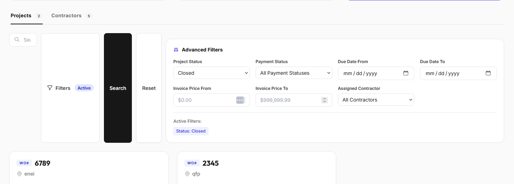

1. i need to add an advance search bar on admin dashboard for project search with many type of filter 
2. make a plan to implment
3. design must be consistance
4. after implmentation when i filter out paid and click search it reload but not filter project . its show all project
5. investigate this issue
6. make a plan to fix this issue
7.i see its works fine . but 
8. investigate and make a plan to fix ui . ui must be consitance
9.after this implmentation i see ui is fix but this problem is again when i filter out paid and click search it reload but not filter project . its show all project