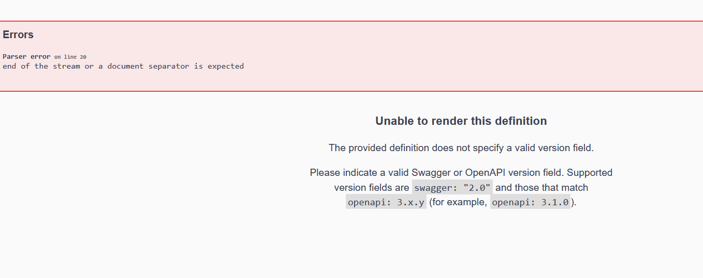
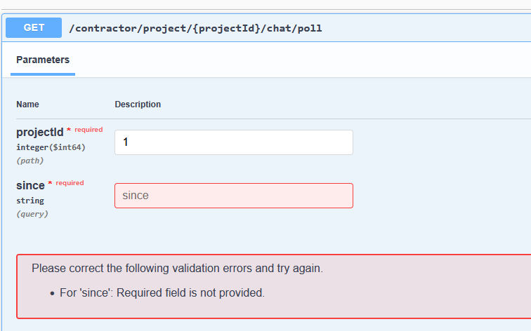

1.now i need to make restapi only for contractor features.
2.make a plan to implment that feature without changing current features
3. after implment i see 
    when i am enter http://76.13.221.43:8085/swagger-ui.html it auto redirect http://76.13.221.43:8085/login

4.     zation in 2 ms
2026-03-17T10:35:19.093-04:00 ERROR 308722 --- [skylink-media-service] [io-8085-exec-10] o.a.c.c.C.[.[.[/].[dispatcherServlet]    : Servlet.service() for servlet [dispatcherServlet] in context with path [] threw exception [Handler dispatch failed: java.lang.NoSuchMethodError: 'void org.springframework.web.method.ControllerAdviceBean.<init>(java.lang.Object)'] with root cause

java.lang.NoSuchMethodError: 'void org.springframework.web.method.ControllerAdviceBean.<init>(java.lang.Object)'
        at org.springdoc.core.service.GenericResponseService.lambda$getGenericMapResponse$8(GenericResponseService.java:702) ~[springdoc-openapi-starter-common-2.3.0.jar:2.3.0]
        at java.base/java.util.stream.ReferencePipeline$2$1.accept(ReferencePipeline.java:178) ~[na:na]
        at java.base/java.util.Spliterators$ArraySpliterator.forEachRemaining(Spliterators.java:1024) ~[na:na]
5.      2026-03-17T10:41:12.331-04:00 ERROR 312676 --- [skylink-media-service] [nio-8085-exec-8] o.a.c.c.C.[.[.[/].[dispatcherServlet]    : Servlet.service() for servlet [dispatcherServlet] in context with path [] threw exception [Handler dispatch failed: java.lang.NoSuchMethodError: 'void org.springframework.web.method.ControllerAdviceBean.<init>(java.lang.Object)'] with root cause

java.lang.NoSuchMethodError: 'void org.springframework.web.method.ControllerAdviceBean.<init>(java.lang.Object)'
        at org.springdoc.core.service.GenericResponseService.lambda$getGenericMapResponse$8(GenericResponseService.java:705) ~[springdoc-openapi-starter-common-2.4.0.jar:2.4.0]
        at java.base/java.util.stream.ReferencePipeline$2$1.accept(ReferencePipeline.java:178) ~[na:na]
        at java.base/java.util.Spliterators$ArraySpliterator.forEachRemaining(Spliterators.java:1024) ~[na:na]
        at java.base/java.util.stream.AbstractPipeline.copyInto(AbstractPipeline.java:509) ~[na:na]
        at java.base/java.util.stream.AbstractPipeline.wrapAndCopyInto(AbstractPipeline.java:499) ~[na:na]
        at java.base/java.util.stream.AbstractPipeline.evaluate(AbstractPipeline.java:575) ~[na:na]
        at java.base/java.util.stream.AbstractPipeline.evaluateToArrayNode(AbstractPipeline.java:260) ~[na:na]
        at java.base/java.util.stream.ReferencePipeline.toArray(ReferencePipeline.java:616) ~[na:na]
        at java.base/java.util.stream.ReferencePipeline.toArray(ReferencePipeline.java:622) ~[na:na]
        at java.base/java.util.stream.ReferencePipeline.toList(ReferencePipeline.java:627) ~[na:na]
        at org.springdoc.core.service.GenericResponseService.getGenericMapResponse(GenericResponseService.java:707) ~[springdoc-openapi-starter-common-2.4.0.jar:2.4.0]
        at org.springdoc.core.service.GenericResponseService.build(GenericResponseService.java:246) ~[springdoc-openapi-starter-common-2.4.0.jar:2.4.0]

6.        